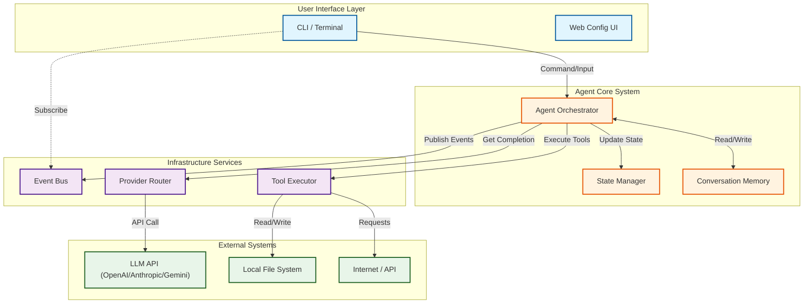
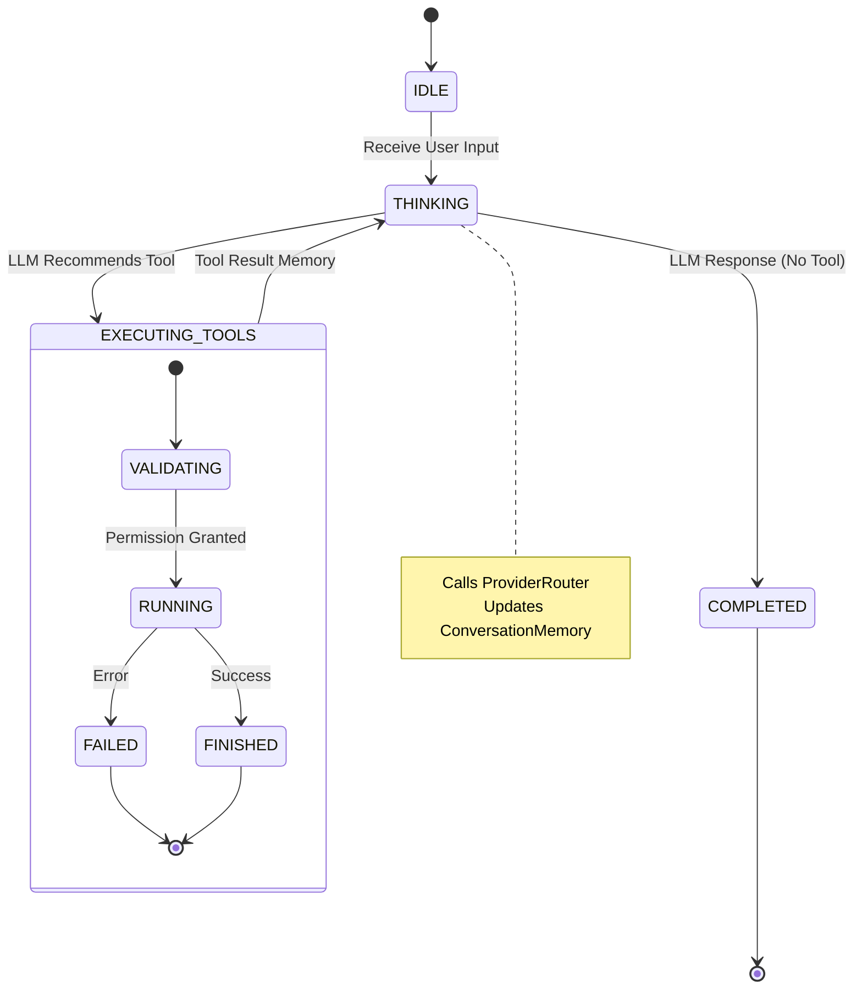
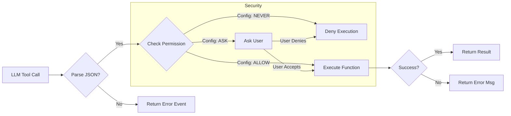
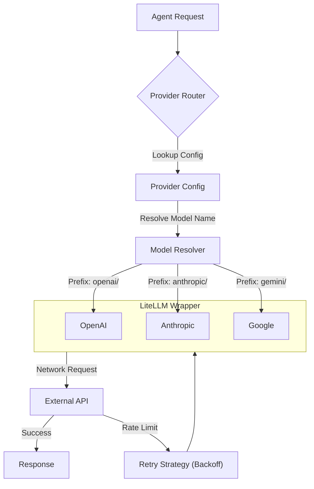

# Developer Guide

Welcome to the **Capybara Vibe** developer documentation. This guide provides a deep dive into the internal architecture, data flow, and extension points of the library.

## 📚 Table of Contents
- [Architecture Overview](#architecture-overview)
- [System Architecture Diagram](#system-architecture-diagram)
- [Component Details](#component-details)
    - [Agent Core & State Machine](#1-agent-core--state-machine)
    - [Tool Execution Pipeline](#2-tool-execution-pipeline)
    - [Provider Routing & LLM](#3-provider-routing--llm)
    - [Event Bus & Delegation](#4-event-bus--delegation)
- [Development Setup](#development-setup)
- [Extending the Library](#extending-the-library)

---

## 🏗 Architecture Overview

Capybara Vibe follows a **modular, event-driven architecture**. The system is centered around an autonomous `Agent` that operates in a loop of observing, thinking, and acting.

### Key Architectural Concepts

1.  **State-Driven**: The agent moves through explicit states (`IDLE`, `THINKING`, `EXECUTING_TOOLS`) managed by a `StateManager`.
2.  **Event-Driven**: Internally, components communicate via an async `EventBus`. This decouples the UI, logging, and parent/child agent coordination.
3.  **Tool-First**: Capabilities are exposed as tools. The `ToolExecutor` handles permission checks, parsing, and execution.
4.  **Provider-Agnostic**: All LLM interactions are routed through `ProviderRouter`, which wraps `litellm` to support any provider (OpenAI, Anthropic, Gemini, etc.).

---

## 📊 System Architecture Diagram

This high-level view shows how the CLI interacts with the core Agent, how the Agent coordinates with Memory and Tools, and how it communicates with external LLM Providers.



---

## 🔍 Component Details

### 1. Agent Core & State Machine

The `Agent` (`src/capybara/core/agent/agent.py`) is a state machine. It transitions between states based on LLM responses and tool results. The `StateManager` ensures transitions are valid and logged.



### 2. Tool Execution Pipeline

The `ToolExecutor` (`src/capybara/core/execution/tool_executor.py`) is responsible for safely parsing, validating, and running tools. It acts as a security gatekeeper.



### 3. Provider Routing & LLM

The `ProviderRouter` (`src/capybara/providers/router.py`) abstracts away the differences between LLM providers. It handles model name resolution (e.g., adding `gemini/` prefix) and retry logic.



### 4. Event Bus & Delegation

The system tracks progress via an async `EventBus`. This is critical for the UI to display "Thinking...", "Running tool...", etc. without the core agent code needing to know about `rich` or the terminal.

-   **Publishers**: Agent, ToolExecutor, StateManager.
-   **Subscribers**: UI Renderer, Session Logger.
-   **Key Events**: `TOOL_START`, `TOOL_DONE`, `AGENT_STATE_CHANGE`.

---

## 🛠 Development Setup

### Prerequisites
- Python 3.10+
- `pip` or `poetry`

### Installation

1. **Clone the repository**
   ```bash
   git clone https://github.com/yourusername/capybara-vibe-coding
   cd capybara-vibe-coding
   ```

2. **Install dependencies (Editable mode)**
   ```bash
   pip install -e ".[dev]"
   ```

3. **Run Tests**
   ```bash
   pytest
   ```

---

## 💻 Using the Internal API

### Basic Agent Setup

```python
import asyncio
from capybara.core.agent.agent import Agent, AgentConfig
from capybara.memory.window import ConversationMemory
from capybara.providers.router import ProviderRouter
from capybara.tools.registry import ToolRegistry

async def main():
    # 1. Setup
    registry = ToolRegistry()
    memory = ConversationMemory()
    provider = ProviderRouter(default_model="gpt-4o")
    
    # 2. Configure
    config = AgentConfig(model="gpt-4o", mode="parent")
    
    # 3. Create Agent
    agent = Agent(
        config=config,
        memory=memory,
        tools=registry,
        provider=provider
    )
    
    # 4. Run
    response = await agent.run("Write a poem about coding.")
    print(response)

if __name__ == "__main__":
    asyncio.run(main())
```

---

## 🔌 Extending the Library

### Adding a New Tool

```python
from capybara.tools.registry import ToolRegistry

registry = ToolRegistry()

@registry.tool(
    name="sys_info",
    description="Get system information",
    parameters={"type": "object", "properties": {}}
)
async def sys_info():
    import platform
    return f"System: {platform.system()} {platform.release()}"
```

### Listening to Events

You can hook into the event bus to build custom UIs or loggers.

```python
from capybara.core.delegation.event_bus import get_event_bus, EventType

bus = get_event_bus()

# Define handler
async def on_tool_start(event):
    print(f"Starting tool: {event.tool_name}")

# Subscribe
bus.subscribe(EventType.TOOL_START, on_tool_start)
```