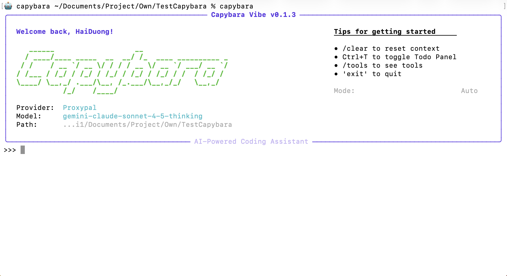
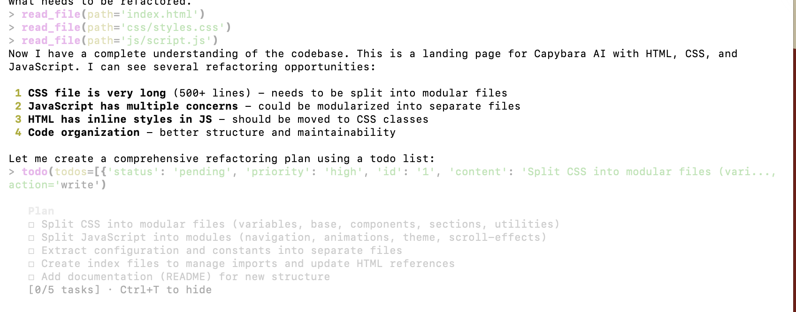
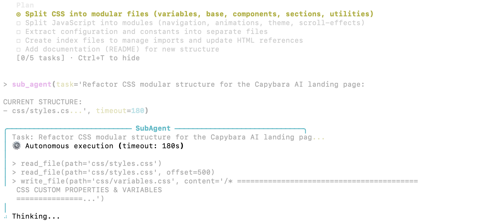
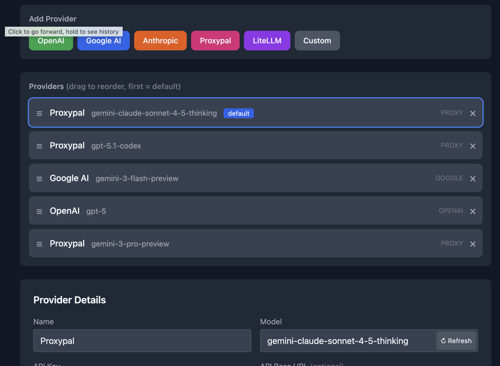

# CAPYBARA VIBE

Capybara Vibe is a powerful Multi-Agent CLI Coding tool designed to assist developers with coding tasks. It leverages multiple AI providers to offer a versatile and efficient coding companion. Whether you need a quick code snippet, a complex refactor, or a long-form planning session, Capybara Vibe adapts to your workflow.

📚 **[Visit Official Documentation](https://haiduongcable.github.io/capybara-doc)** | 📦 **[Download Releases](https://github.com/Haiduongcable/capybara-vibe/releases)**

*I write this README by myself, no LLM, no any icon bla bla, trust me bro*
## VISUAL OVERVIEW

<table border="1" cellspacing="0" cellpadding="10" width="100%">
  <!-- Top: CLI Interface -->
  <tr>
    <td colspan="2" align="center" style="padding: 10px;">
      
      <br />
      <b>CLI Interface</b>
    </td>
  </tr>
  <!-- Middle: Planning & Multi-Agent -->
  <tr>
    <td align="center" width="50%" style="padding: 10px;">
      
      <br />
      <b>Planning Mode</b>
    </td>
    <td align="center" width="50%" style="padding: 10px;">
      
      <br />
      <b>Multi-Agent Architecture</b>
    </td>
  </tr>
  <!-- Bottom: Multi-Provider -->
  <tr>
    <td colspan="2" align="center" style="padding: 10px;">
      
      <br />
      <b>Multi-Provider Selection</b>
    </td>
  </tr>
</table>

## KEY FEATURES

*   **Multi-Agent Coding**
    Smart delegation of tasks to sub-agents for specialized handling.

*   **Multi-Provider Support**
    Seamlessly switch between OpenAI, Anthropic, Google AI Studio, OpenRouter, and Litellm.

*   **Advanced Planning**
    Includes "Todo Planning" and "Plan Mode" to breakdown complex objectives into manageable tasks.

*   **Context Management**
    "Memory Smart Compress" ensures efficient context usage for long conversations.

*   **Customization**
    Support for custom commands to tailor the tool to your specific needs.

*   **Conversation Recovery**
    Never lose your context; resume previous sessions with ease.

*   **Free Account Support**
    Integrates with [ProxyPal](https://github.com/heyhuynhgiabuu/proxypal) - [CLIProxyAPI](https://github.com/router-for-me/CLIProxyAPI) for using free tier AI accounts (OpenAI Codex, Claude Pro, Google Antigravity).

*   **Safety & Security**
    Built-in protection against accidental operations in sensitive system directories and a specific "Safe Mode" for high-risk tasks. (trust me I am not robot)
--------------------------------------------------------------------------------

## INSTALLATION

### 1. Download Pre-built Binaries (Recommended)

**Download the latest release for your platform:**

👉 **[Download from GitHub Releases](https://github.com/Haiduongcable/capybara-vibe/releases)**

#### macOS

```bash
# Download capybara binary for macOS
# Extract and run:
chmod +x capybara
./capybara --version

# Optional: Move to PATH
sudo mv capybara /usr/local/bin/
```

#### Ubuntu/Debian

```bash
# Download the .deb file and install:
sudo dpkg -i capybara-vibe_*_amd64.deb
capybara --version
```

#### Fedora/RHEL/CentOS

```bash
# Download the .rpm file and install:
sudo rpm -i capybara-vibe-*.x86_64.rpm
capybara --version
```

#### Windows

```powershell
# Download capybara.exe
# Run from PowerShell or Command Prompt:
.\capybara.exe --version
```

### 2. Install via Pip

Package is available on [PyPI](https://pypi.org/project/capybara-vibe/).

```bash
pip install capybara-vibe
```

### 3. Install from Source

```bash
git clone https://github.com/yourusername/capybara-vibe-coding
cd capybara-vibe-coding
pip install -e .
```

--------------------------------------------------------------------------------

## QUICK START

### Initialization

Run the initialization command to set up your configuration. This will open a web UI where you can input your API keys or subscription details.

```bash
capybara init
```

### Start Chatting

Once configured, start the interactive chat session to begin coding.

```bash
capybara
```

--------------------------------------------------------------------------------

## CLI COMMANDS

| Command             | Description                                      |
| ------------------- | ------------------------------------------------ |
| `capybara`     | Start interactive chat session.                  |
| `capybara config`   | Show current configuration.                      |
| `capybara init`     | Initialize configuration via web UI.             |
| `capybara model`    | Get or set the default AI model.                 |
| `capybara resume`   | Resume a previous conversation session.          |
| `capybara run`      | Run a single prompt and exit.                    |

--------------------------------------------------------------------------------

## OPERATION MODES

Capybara Vibe supports different modes to suit your workflow. You can run the CLI with specific flags to adjust its behavior:

### Standard Mode (Default)
Run without any flags for balanced autonomy. The agent will ask for permission before sensitive actions but proceeds with safe reads automatically.

```bash
capybara
```

### Plan Mode
Use this mode for architectural planning or code analysis. It is **read-only** and prevents the agent from making any changes to your files.

```bash
capybara --mode plan
```

### Safe Mode
For maximum control, use Safe Mode. The agent will **always ask for confirmation** before running any shell command or modifying any file.

```bash
capybara --mode safe
```

### Auto Mode
Maximum autonomy with minimal confirmations (use with caution).

```bash
capybara --mode auto
```

--------------------------------------------------------------------------------

## CONFIGURATION & SETUP

### API Providers

You can configure the following providers:
*   OpenAI
*   Anthropic
*   Google AI Studio
*   OpenRouter
*   Litellm

### Free AI Subscription Setup

### Free AI Subscription Setup

To use free AI subscriptions (e.g., OpenAI Codex, Google Antigravity), please refer to our [Setup Guide](GUIDE.md).

--------------------------------------------------------------------------------


## LICENSE

MIT License

*Also all of these were written by myself!!*