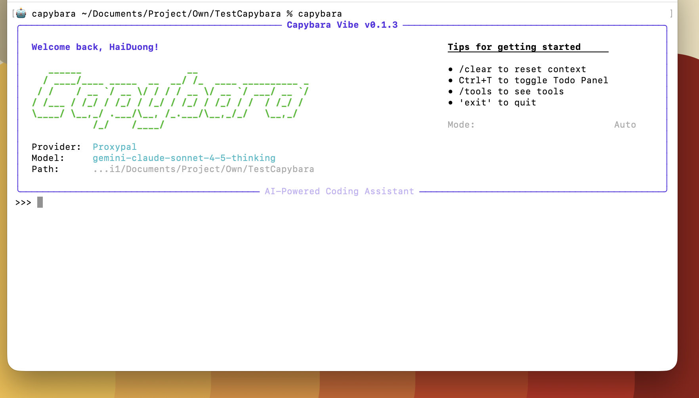
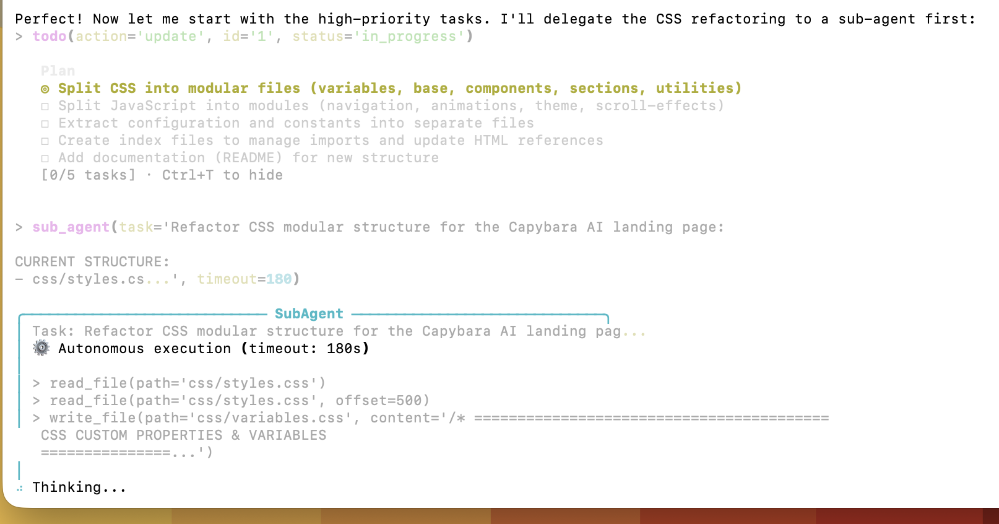

# CAPYBARA VIBE

Multi-Agent AI CLI Coding Assistant based on Long Chain-of-Thought (CoT) agents. 
Features Smart Memory context management and universal multi-provider support.

--------------------------------------------------------------------------------

## OVERVIEW

Capybara Vibe is a powerful CLI tool designed to assist developers with coding tasks. It leverages multiple AI providers to offer a versatile and efficient coding companion. Whether you need a quick code snippet, a complex refactor, or a long-form planning session, Capybara Vibe adapts to your workflow.

## VISUAL OVERVIEW

### CLI Interface


### Planning Mode


### Multi-Agent Architecture


### Multi-Provider Selection


## KEY FEATURES

*   **Multi-Agent Coding**
    Smart delegation of tasks to sub-agents for specialized handling.

*   **Multi-Provider Support**
    Seamlessly switch between OpenAI, Anthropic, Google AI Studio, OpenRouter, and Litellm.

*   **Advanced Planning**
    Includes "Todo Planning" and "Plan Mode" to breakdown complex objectives into manageable tasks.

*   **Context Management**
    "Memory Smart Compress" ensures efficient context usage for long conversations.

*   **Customization**
    Support for custom commands to tailor the tool to your specific needs.

*   **Conversation Recovery**
    Never lose your context; resume previous sessions with ease.

*   **Free Account Support**
    Integrates with [ProxyPal](https://github.com/heyhuynhgiabuu/proxypal) - [CLIProxyAPI](https://github.com/router-for-me/CLIProxyAPI) for using free tier AI accounts (OpenAI Codex, Claude Pro, Google Antigravity).

*   **Safety & Security**
    Built-in protection against accidental operations in sensitive system directories and a specific "Safe Mode" for high-risk tasks.

--------------------------------------------------------------------------------

## INSTALLATION

### 1. Install via Pip

```bash
pip install capybara-vibe
```

### 2. Install from Source

```bash
git clone https://github.com/yourusername/capybara-vibe-coding
cd capybara-vibe-coding
pip install -e .
```

--------------------------------------------------------------------------------

## QUICK START

### Initialization

Run the initialization command to set up your configuration. This will open a web UI where you can input your API keys or subscription details.

```bash
capybara init
```

### Start Chatting

Once configured, start the interactive chat session to begin coding.

```bash
capybara chat
```

--------------------------------------------------------------------------------

## CLI COMMANDS

| Command             | Description                                      |
| ------------------- | ------------------------------------------------ |
| `capybara chat`     | Start interactive chat session.                  |
| `capybara config`   | Show current configuration.                      |
| `capybara init`     | Initialize configuration via web UI.             |
| `capybara model`    | Get or set the default AI model.                 |
| `capybara resume`   | Resume a previous conversation session.          |
| `capybara run`      | Run a single prompt and exit.                    |

--------------------------------------------------------------------------------

## OPERATION MODES

Capybara Vibe supports different modes to ensure safety and control:

*   **Standard (Default):** Balanced autonomy.
*   **Safe (`--mode safe`):** Forces user confirmation for all file modifications and shell commands.
*   **Plan (`--mode plan`):** Read-only mode for architectural planning without making changes.
*   **Auto (`--mode auto`):** Maximum autonomy (use with caution).

--------------------------------------------------------------------------------

## CONFIGURATION & SETUP

### API Providers

You can configure the following providers:
*   OpenAI
*   Anthropic
*   Google AI Studio
*   OpenRouter
*   Litellm

### Free AI Subscription Setup

### Free AI Subscription Setup

To use free AI subscriptions (e.g., OpenAI Codex, Google Antigravity), please refer to our [Setup Guide](Guide.md).

--------------------------------------------------------------------------------


## LICENSE

MIT License