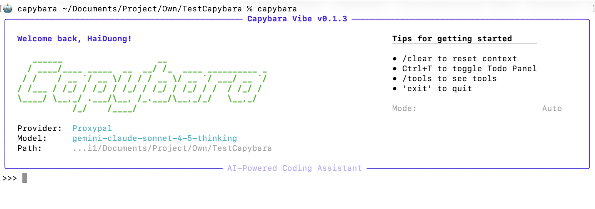

# Capybara Vibe

<p align="center">
  <b>Multi-Agent CLI Coding Assistant powered by AI</b>
</p>

<p align="center">
  <a href="https://pypi.org/project/capybara-vibe/"></a>
  <a href="LICENSE"></a>
  <a href="https://www.python.org/"></a>
  <a href="https://haiduongcable.github.io/capybara-doc"></a>
  <a href="https://github.com/Haiduongcable/capybara-vibe/releases"></a>
</p>

<p align="center">
  
</p>

## Table of Contents

- [Overview](#overview)
- [Key Features](#key-features)
- [Documentation](#documentation)
- [Installation](#installation)
- [Quick Start](#quick-start)
- [CLI Commands](#cli-commands)
- [Operation Modes](#operation-modes)
- [Configuration](#configuration)
- [License](#license)

## Overview

Capybara Vibe is a powerful Multi-Agent CLI Coding tool designed to assist developers with coding tasks. It leverages multiple AI providers to offer a versatile and efficient coding companion. Whether you need a quick code snippet, a complex refactor, or a long-form planning session, Capybara Vibe adapts to your workflow.

## Key Features

- **CLI Interface** - Feature-rich terminal interface with multiple operation modes (Standard, Safe, Plan, Auto), keybindings, and session management.

- **Planning Mode** - Todo-based planning system with sequential task execution, real-time UI panel, and read-only exploration mode.

- **Multi-Agent Coding** - Smart delegation of tasks to autonomous sub-agents for specialized handling.

- **Multi-Provider Support** - Seamlessly switch between OpenAI, Anthropic, Google AI Studio, OpenRouter, and Litellm.

- **Context Management** - "Memory Smart Compress" ensures efficient context usage for long conversations.

- **Conversation Recovery** - Never lose your context; resume previous sessions with ease.

- **Free Account Support** - Integrates with [ProxyPal](https://github.com/heyhuynhgiabuu/proxypal) for using free tier AI accounts.

- **Safety & Security** - Built-in protection against accidental operations and "Safe Mode" for high-risk tasks.

## Documentation

| Document | Description |
|----------|-------------|
| [CLI Interface](docs/DOC_CLI_INTERFACE.md) | Commands, operation modes, keybindings, session management |
| [Planning Mode](docs/DOC_PLANNING_MODE.md) | Todo system, sequential execution, plan mode restrictions |
| [Multi-Agent Architecture](docs/DOC_MULTI_AGENT_ARCHITECTURE.md) | Parent/child agents, delegation, session hierarchy |
| [Multi-Provider Selection](docs/DOC_MULTI_PROVIDER_SELECTION.md) | Provider configuration, LiteLLM router, API setup |
| [Developer Guide](DEVELOPER.md) | Internal architecture, extending the library |

## Installation

### Download Pre-built Binaries (Recommended)

Download the latest release for your platform: **[GitHub Releases](https://github.com/Haiduongcable/capybara-vibe/releases)**

**macOS**
```bash
chmod +x capybara
sudo mv capybara /usr/local/bin/
```

**Ubuntu/Debian**
```bash
sudo dpkg -i capybara-vibe_*_amd64.deb
```

**Fedora/RHEL**
```bash
sudo rpm -i capybara-vibe-*.x86_64.rpm
```

**Windows**
```powershell
.\capybara.exe --version
```

### Install via Pip

```bash
pip install capybara-vibe
```

### Install from Source

```bash
git clone https://github.com/Haiduongcable/capybara-vibe
cd capybara-vibe
pip install -e .
```

## Quick Start

### Initialize Configuration

```bash
capybara init
```

This opens a web UI to configure your API keys.

### Start Chatting

```bash
capybara
```

## CLI Commands

| Command | Description |
|---------|-------------|
| `capybara` | Start interactive chat session |
| `capybara init` | Initialize configuration via web UI |
| `capybara config` | Show current configuration |
| `capybara model` | Get or set the default AI model |
| `capybara resume` | Resume a previous conversation |
| `capybara run` | Run a single prompt and exit |

## Operation Modes

| Mode | Command | Description |
|------|---------|-------------|
| Standard | `capybara` | Balanced autonomy (default) |
| Plan | `capybara --mode plan` | Read-only, no file modifications |
| Safe | `capybara --mode safe` | Asks confirmation for everything |
| Auto | `capybara --mode auto` | Maximum autonomy (use with caution) |

## Configuration

Configure providers via the web UI:

```bash
capybara init
```

Supported providers:
- OpenAI
- Anthropic
- Google AI Studio
- OpenRouter
- Litellm
- ProxyPal (free tier support)

For detailed configuration, see [Multi-Provider Selection](docs/DOC_MULTI_PROVIDER_SELECTION.md).

## License

MIT License