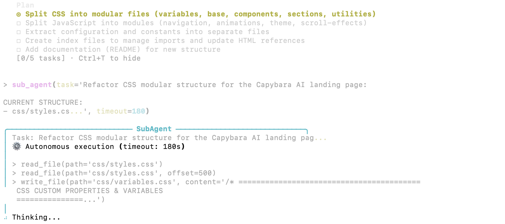

# Multi-Agent Architecture

<p align="center">
  
</p>

Capybara Vibe implements a parent-child agent delegation system that enables complex tasks to be distributed to specialized sub-agents.

## Overview

The multi-agent architecture consists of:
- **Parent Agent**: Main orchestrator that interacts with the user
- **Child Agents**: Autonomous sub-agents that execute delegated tasks
- **Delegation System**: Logic for deciding when and how to delegate
- **Session Management**: Hierarchical session tracking

## Parent and Child Agents

### Parent Agent

The parent agent is the main agent that:
- Receives user input
- Has access to all tools including `sub_agent` and todo tools
- Coordinates work across child agents
- Maintains conversation history with the user

### Child Agent

Child agents are spawned for specific tasks:
- Inherit parent's LLM configuration and API keys
- Have access to core tools (read, write, edit, bash, grep)
- Cannot access delegation tools (no recursive spawning)
- Cannot access todo tools (parent manages planning)
- Work autonomously without asking questions
- Return comprehensive work reports

## The sub_agent Tool

The `sub_agent` tool delegates autonomous work:

```json
{
  "task": "Refactor the UserController class in src/api/controllers/user.py to use async/await pattern. Update all methods and ensure tests pass.",
  "timeout": 180
}
```

### Parameters

| Parameter | Type | Description |
|-----------|------|-------------|
| `task` | string | Comprehensive task description with full context |
| `timeout` | number | Maximum execution time in seconds (default: 180) |

### Task Description Best Practices

Since child agents don't have access to parent's conversation history, provide:
- Specific files and directories involved
- Expected outcomes and requirements
- Any constraints or preferences
- Relevant context from prior conversation

Good example:
```
"Refactor src/api/auth.py to use JWT instead of session tokens. 
Requirements:
- Use PyJWT library
- Maintain backward compatibility with existing endpoints
- Add token refresh endpoint at /api/auth/refresh
- Update tests in tests/api/test_auth.py"
```

## Delegation Decision Logic

The `DelegationDecider` class determines whether tasks should be delegated.

### Delegate When

1. **Isolated Scope**: Task doesn't need parent conversation context
2. **Clear Boundaries**: Well-defined inputs and outputs (specific files, clear actions)
3. **Parallelizable**: No sequential dependency on other tasks
4. **No Shared State**: Won't conflict with concurrent work

### Do Not Delegate When

1. **Requires Context**: References "previous", "earlier", "above mentioned"
2. **Vague Scope**: Uses terms like "improve", "optimize" without specifics
3. **Sequential Dependency**: Depends on completion of other tasks
4. **Modifies Shared State**: Could conflict with other operations

### Detection Keywords

Context-requiring keywords (prevent delegation):
- "previous", "earlier", "above", "mentioned", "discussed"

Vague keywords (prevent delegation unless specific files given):
- "improve", "optimize", "enhance", "better"

## Session Hierarchy

### Session Management

Each agent gets a unique session ID:

```
Parent Session: abc123
  ├── Child Session: def456 (Task: Refactor auth)
  └── Child Session: ghi789 (Task: Update tests)
```

### Session Tracking

The `SessionManager` tracks:
- Parent-child relationships
- Session creation time
- Task descriptions
- Completion status

### Logging

All sessions log to the parent's log file:
```
[Parent abc123] Agent run started
[Parent abc123] Delegating to child def456
[Child def456] Working on: Refactor auth
[Child def456] Tool: edit_file on src/api/auth.py
[Parent abc123] Child def456 completed
```

## Work Reports

Child agents return comprehensive reports:

```
## Work Report

### Summary
Refactored authentication module to use JWT tokens.

### Files Modified
- src/api/auth.py (edited: replaced session logic with JWT)
- src/api/routes.py (edited: added /refresh endpoint)
- tests/api/test_auth.py (edited: updated 5 test cases)

### Tools Used
- read_file: 3 calls
- edit_file: 3 calls
- bash: 2 calls (running tests)

### Status
SUCCESS - All changes complete, tests passing
```

## Error Handling

### Timeout Handling

If a child agent exceeds timeout:
1. Execution is cancelled
2. Partial work report is generated
3. Files modified so far are listed
4. Parent is notified with partial results

### Exception Handling

On errors:
1. Exception is logged
2. Stack trace is captured (for debugging)
3. Error report returned to parent
4. Session marked as failed

### Failure Analysis

The `FailureAnalyzer` extracts:
- Error type and message
- Likely cause
- Suggested recovery actions

## Progress Display

During child execution, parent shows:

```
[Sub-Agent Working]
Task: Refactor authentication module
Status: Executing tools...
Duration: 45s / 180s
```

The `CommunicationFlowRenderer` provides real-time updates via the event bus.

## Event Communication

### Event Bus

Components communicate via async events:

| Event | Publisher | Description |
|-------|-----------|-------------|
| `AGENT_START` | Agent | Agent begins processing |
| `AGENT_DONE` | Agent | Agent completes (success/failure) |
| `TOOL_START` | ToolExecutor | Tool execution begins |
| `TOOL_DONE` | ToolExecutor | Tool execution completes |

### Subscribing to Events

```python
from capybara.core.delegation.event_bus import get_event_bus, EventType

bus = get_event_bus()

async def on_tool_done(event):
    print(f"Tool completed: {event.tool_name}")

bus.subscribe(EventType.TOOL_DONE, on_tool_done)
```

## Tool Filtering

Tools are filtered by agent mode:

| Tool | Parent | Child |
|------|--------|-------|
| read_file | Yes | Yes |
| write_file | Yes | Yes |
| edit_file | Yes | Yes |
| bash | Yes | Yes |
| grep | Yes | Yes |
| sub_agent | Yes | No |
| write_todo | Yes | No |
| update_todo_status | Yes | No |

## Architecture

Source files:
- `src/capybara/core/agent/agent.py` - Agent with mode support
- `src/capybara/core/delegation/delegation_decider.py` - Delegation logic
- `src/capybara/core/delegation/session_manager.py` - Session hierarchy
- `src/capybara/core/delegation/event_bus.py` - Async event system
- `src/capybara/tools/builtin/delegation/sub_agent_tool.py` - Sub-agent tool
- `src/capybara/tools/builtin/delegation/agent_setup.py` - Child agent setup
- `src/capybara/tools/builtin/delegation/progress_display.py` - Progress UI
- `src/capybara/tools/builtin/delegation/work_report.py` - Report generation
