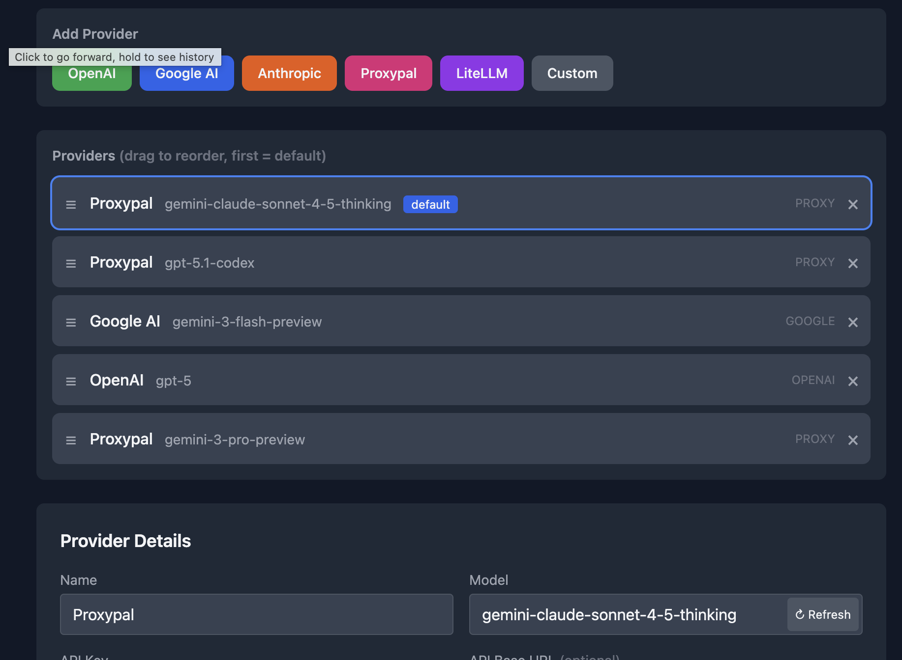

# Multi-Provider Selection

<p align="center">
  
</p>

Capybara Vibe supports multiple AI providers through a unified routing layer built on LiteLLM.

## Supported Providers

| Provider | API Type | Model Prefix | Description |
|----------|----------|--------------|-------------|
| OpenAI | `openai` | `openai/` | GPT-4, GPT-4o, GPT-3.5 |
| Anthropic | `anthropic` | `anthropic/` | Claude 3, Claude 3.5 |
| Google AI Studio | `google` | `gemini/` | Gemini Pro, Gemini Ultra |
| OpenRouter | `openrouter` | varies | Aggregated models |
| LiteLLM | `litellm` | `openai/` | Custom endpoints |
| ProxyPal | `proxy` | `openai/` | Free tier AI accounts |

## Configuration

### Web UI Setup

The recommended setup method:

```bash
capybara init
```

This opens a local web UI where you can:
1. Select your provider
2. Enter API credentials
3. Test the connection
4. Save configuration

### Configuration File

Providers are stored in `~/.capybara/config.yaml`:

```yaml
providers:
  - name: OpenAI
    api_type: openai
    model: gpt-4o
    api_key: sk-your-key-here
    rpm: 3500
    tpm: 90000
    max_tokens: 8000

  - name: Anthropic
    api_type: anthropic
    model: claude-3-5-sonnet-20241022
    api_key: sk-ant-your-key-here
    rpm: 1000
    tpm: 100000
    max_tokens: 8000

  - name: Google
    api_type: google
    model: gemini-1.5-pro
    api_key: your-google-key
    rpm: 60
    tpm: 30000
    max_tokens: 8000
```

## Provider Configuration Fields

| Field | Type | Description | Default |
|-------|------|-------------|---------|
| `name` | string | Display name | "default" |
| `api_type` | string | Provider type | "openai" |
| `model` | string | Model identifier | "gpt-4o" |
| `api_key` | string | API key | null |
| `api_base` | string | Custom API endpoint | null |
| `rpm` | int | Requests per minute | 3500 |
| `tpm` | int | Tokens per minute | 90000 |
| `max_tokens` | int | Max tokens per response | 8000 |

## Provider Router

The `ProviderRouter` class handles all LLM interactions:

### Model Name Resolution

Models are automatically prefixed for LiteLLM:

| API Type | Original Model | LiteLLM Model |
|----------|----------------|---------------|
| openai | gpt-4o | gpt-4o (no prefix for standard) |
| anthropic | claude-3-opus | anthropic/claude-3-opus |
| google | gemini-pro | gemini/gemini-pro |
| proxy/custom | any-model | openai/any-model |

### Custom Endpoints

For custom API endpoints (proxy servers, local models):

```yaml
providers:
  - name: LocalLLM
    api_type: litellm
    model: codellama
    api_base: http://localhost:8080
    api_key: optional-key
```

The router automatically appends `/v1` for OpenAI-compatible endpoints.

## Rate Limiting

### Retry Policy

The router implements automatic retry for:
- Rate limit errors: 5 retries with exponential backoff
- Timeout errors: 3 retries
- General failures: Cooldown of 10 seconds

```python
retry_policy = RetryPolicy(
    RateLimitErrorRetries=5,
    TimeoutErrorRetries=3,
)

allowed_fails_policy = AllowedFailsPolicy(
    RateLimitErrorAllowedFails=100,
)
```

### Token and Request Limits

Configure limits per provider:

```yaml
providers:
  - name: OpenAI
    model: gpt-4o
    rpm: 3500    # 3500 requests per minute
    tpm: 90000   # 90,000 tokens per minute
```

The router respects these limits and queues requests appropriately.

## Streaming Support

Both streaming and non-streaming modes are supported:

### Streaming (Default)

```python
async for chunk in router.complete(messages, stream=True):
    print(chunk.content, end="")
```

### Non-Streaming

```python
response = await router.complete_non_streaming(messages)
print(response.content)
```

## Free Account Support

### ProxyPal Integration

Capybara integrates with ProxyPal for using free tier AI accounts:
- OpenAI Codex free tier
- Claude Pro
- Google Antigravity

Setup via web UI or manual configuration:

```yaml
providers:
  - name: ProxyPal
    api_type: proxy
    model: claude-3-5-sonnet
    api_base: https://your-proxypal-instance.com
    api_key: your-proxypal-token
```

See [ProxyPal](https://github.com/heyhuynhgiabuu/proxypal) and [CLIProxyAPI](https://github.com/router-for-me/CLIProxyAPI) for setup guides.

## Model Selection

### Interactive Selection

```bash
capybara model
```

Shows numbered list of available models from configured providers.

### Direct Selection

```bash
capybara model gpt-4o
```

### Programmatic Selection

```python
from capybara.providers.router import ProviderRouter
from capybara.core.config import load_config

config = load_config()
router = ProviderRouter(
    providers=config.providers,
    default_model="claude-3-5-sonnet"
)
```

## Multiple Providers

Configure multiple providers for flexibility:

```yaml
providers:
  - name: OpenAI-Primary
    api_type: openai
    model: gpt-4o
    api_key: sk-primary-key

  - name: OpenAI-Backup
    api_type: openai
    model: gpt-4
    api_key: sk-backup-key

  - name: Anthropic-Fallback
    api_type: anthropic
    model: claude-3-5-sonnet
    api_key: sk-ant-key
```

Switch between models using `capybara model`.

## API Logging

When a session ID is provided, API requests are logged:

- Request details (model, messages, tools)
- Response chunks and timing
- Errors and retries
- Token usage

Logs are stored per-session for debugging.

## Error Handling

### Common Errors

| Error | Cause | Solution |
|-------|-------|----------|
| `RateLimitError` | Exceeded API limits | Router retries automatically |
| `AuthenticationError` | Invalid API key | Check credentials in config |
| `InvalidRequestError` | Bad model/params | Verify model name |
| `TimeoutError` | Request took too long | Router retries; increase timeout |

### Timeout Configuration

```python
response = await router.complete(
    messages=messages,
    timeout=120.0  # 2 minutes
)
```

## Architecture

Source files:
- `src/capybara/providers/router.py` - ProviderRouter implementation
- `src/capybara/core/config/settings.py` - ProviderConfig model
- `src/capybara/web/routes.py` - Web UI configuration endpoints
- `src/capybara/cli/main.py` - CLI model command
