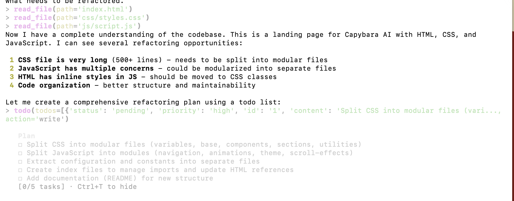

# Planning Mode

<p align="center">
  
</p>

Capybara Vibe includes a sophisticated planning system that helps organize complex tasks into manageable steps with real-time progress tracking.

## Overview

The planning system consists of:
- **Todo Tools**: Create, read, update, and delete task lists
- **Todo Panel**: Real-time UI for task visibility
- **Plan Mode**: Read-only operation mode for safe exploration

## Todo Tools

### write_todo

Create a new todo list. Can only be used when the current list is empty or all tasks are completed.

```json
{
  "todos": [
    {"id": "1", "content": "Analyze existing codebase"},
    {"id": "2", "content": "Design new architecture"},
    {"id": "3", "content": "Implement changes"}
  ]
}
```

**Constraints**:
- IDs must be unique
- Only ONE task can be `in_progress` at a time (sequential execution)
- Cannot create new list while tasks are pending (use `delete_todo` first)

### read_todo

View the current todo list with statuses.

### update_todo_status

Update a specific todo item's status.

```json
{
  "id": "1",
  "status": "completed"
}
```

**Available statuses**:
- `pending` - Not started
- `in_progress` - Currently being worked on
- `completed` - Finished
- `cancelled` - Abandoned

**Constraints**:
- Cannot update already completed or cancelled tasks
- Only one task can be `in_progress` at a time
- Must complete or cancel current task before starting another

### delete_todo

Clear the entire todo list. Use when the plan changes completely.

## Sequential Execution Model

The todo system enforces sequential execution:

1. Only ONE task can be `in_progress` at any time
2. Complete the current task before starting the next
3. This prevents context switching and ensures focused work

Example workflow:
```
Task 1: pending -> in_progress -> completed
Task 2: pending -> in_progress -> completed
Task 3: pending -> in_progress -> completed
```

## Todo Panel UI

A persistent panel displays the todo list in the terminal.

### Toggle Visibility

Press `Ctrl+T` to show/hide the todo panel.

### Panel Display

```
+---------------------------+
|       Todo List           |
+---------------------------+
| [x] 1. Analyze codebase   |
| [>] 2. Design architecture|
| [ ] 3. Implement changes  |
+---------------------------+
```

Status indicators:
- `[ ]` - Pending
- `[>]` - In Progress
- `[x]` - Completed
- `[-]` - Cancelled

### Real-Time Updates

The panel updates automatically when:
- New todos are created
- Task status changes
- Todos are deleted

The UI subscribes to state changes via the `TodoState` manager.

## Plan Mode Operation

Plan mode is a read-only mode for safe codebase exploration:

```bash
capybara --mode plan
```

### Disabled Tools

These tools are completely hidden in plan mode:
- `write_file`
- `edit_file`
- `delete_file`
- `todo` (all todo tools)
- `sub_agent`

### Restricted Bash Commands

Dangerous commands are blocked:
- `rm` - Delete files
- `mv` - Move files
- `git commit` - Git writes
- `git push` - Git pushes
- `pip install` / `npm install` - Installation
- Output redirection (`>`, `>>`)

### Allowed Operations

Safe read-only commands work normally:
- `cat`, `head`, `tail` - View files
- `ls`, `find`, `tree` - List directories
- `git status`, `git diff`, `git log` - Git reads
- `grep`, `awk`, `sed` (without `-i`)

## State Management

### TodoState Class

Manages todo state and notifies subscribers of changes.

```python
from capybara.tools.builtin.todo_state import todo_state

# Subscribe to changes
def on_change(todos):
    print(f"Todos updated: {len(todos)} items")

todo_state.subscribe(on_change)
```

### Persistence

Todos are stored in memory for the session. They are:
- Reset when starting a new session
- Not persisted across sessions
- Designed for single-task workflows

## Best Practices

### Creating Good Todo Lists

1. **Be Specific**: Include file paths and concrete actions
2. **Order Matters**: List tasks in execution order
3. **Atomic Tasks**: Each task should be completable independently
4. **Clear Outcomes**: Define what "done" means

Good example:
```json
{
  "todos": [
    {"id": "analyze", "content": "Read src/api/routes.py to understand current endpoints"},
    {"id": "design", "content": "Design new /users endpoint in docs/api-design.md"},
    {"id": "implement", "content": "Add UserController in src/api/controllers/user.py"},
    {"id": "test", "content": "Write tests in tests/api/test_user.py"}
  ]
}
```

### Using Plan Mode

Use plan mode when:
- Exploring unfamiliar codebases
- Analyzing architecture before changes
- Reviewing code without risk
- Planning refactoring strategies

## Architecture

Source files:
- `src/capybara/tools/builtin/todo.py` - Todo tool implementations
- `src/capybara/tools/builtin/todo_state.py` - State management
- `src/capybara/ui/todo_panel.py` - UI panel rendering
- `src/capybara/cli/interactive.py` - Mode configuration (lines 183-230)
